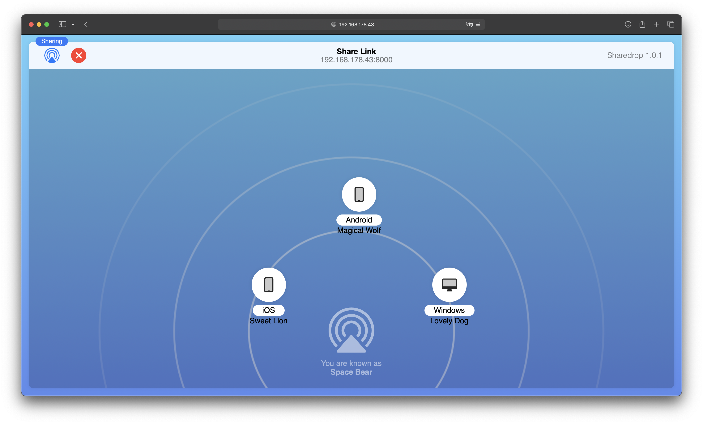

# ShareDrop

ShareDrop is a lightweight, Python-based alternative to Apple's AirDrop, allowing seamless file sharing over a local network. This application uses a simple HTTP server and WebSocket connections to enable easy and secure file exchange between devices on the same network.



## Requirements

- Python 3.12+
- `websockets` library

## Installation

1. Clone this repository:
```bash
git clone https://github.com/RobinRauber/ShareDrop.git
cd ShareDrop
```
2. Install the required libraries.
```bash
pip install websockets
```

## Usage

1. Run both `client.py` and `exchange.py` scripts. 
   - **client.py** serves the main HTML interface (`index.html`), providing a user-friendly front end for file exchange.
   - **exchange.py** manages file transfer functionality via WebSockets.

2. Ensure all devices are connected to the same network, and share the generated URL from `client.py` for others to connect and exchange files.

   Run `client.py`:

   ```
   python client.py
   ```

   Run `exchange.py`:

   ```
   python exchange.py
   ```

## License

Distributed under the [GPL-3.0 License](https://opensource.org/licenses/GPL-3.0).